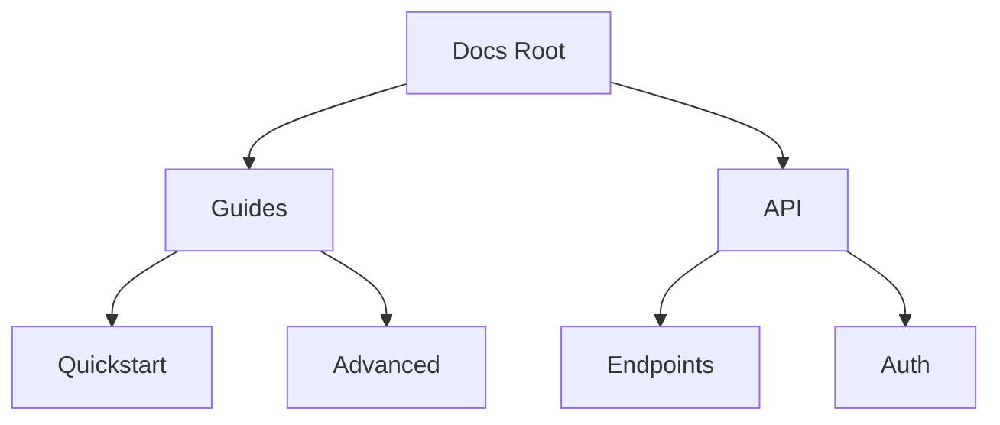

## Overview

Rock provides powerful tools to create, organize, and collaborate on your project documentation. You can edit rich content, structure pages hierarchically, search efficiently, track changes with version history, and share securely with teams.

<Columns cols={3}>
  <Card title="Editing Tools" icon="edit-3" href="#editing">
    Format text, add code blocks, and embed media seamlessly.
  </Card>
  <Card title="Organization" icon="folder" href="#organization">
    Build folder structures and navigate hierarchies easily.
  </Card>
  <Card title="Search & Filter" icon="search" href="#search">
    Find content quickly with advanced search options.
  </Card>
  <Card title="Version History" icon="git-branch" href="#versions">
    Track revisions and restore previous versions.
  </Card>
  <Card title="Collaboration" icon="users" href="#collaboration">
    Share, comment, and co-edit documents in real-time.
  </Card>
</Columns>

## Document Editing and Formatting

Use Rock's intuitive editor to create professional documentation. You support Markdown, rich text, and embeds.

<Steps>
  <Step title="Start Editing" icon="edit">
    Open any page and click the edit button.
  </Step>
  <Step title="Format Content">
    Use the toolbar for bold, italics, lists, and headings.
  </Step>
  <Step title="Add Code Blocks">
    Insert fenced code blocks with syntax highlighting.
  </Step>
</Steps>

<CodeGroup tabs="Markdown,Rich Text">
  ```markdown
  ## Heading

  **Bold text** and _italic text_.

  ```javascript
  console.log('Hello, Rock!');
  ```
  ```
  ```html
  <h2>Heading</h2>

  <strong>Bold text</strong> and <em>italic text</em>.

  <pre><code class="language-javascript">console.log('Hello, Rock!');</code></pre>
  ```
</CodeGroup>

<Callout kind="tip">
  Pro tip: Use `Ctrl+B` for bold and `Ctrl+K` for links to speed up editing.
</Callout>

## Folder and Hierarchy Organization

Organize your docs into folders and subfolders for clear navigation.



Customize sidebar navigation by dragging pages between folders.

## Search and Filtering

Rock's search helps you locate content instantly.

<Tabs>
  <Tab title="Basic Search" icon="search">
    Type keywords in the global search bar to find matching pages.
  </Tab>
  <Tab title="Advanced Filters" icon="filter">
    Filter by tags, folders, or last updated date.

    | Filter Type | Description |
    |-------------|-------------|
    | Tags | `tag:api` |
    | Folder | `folder:guides` |
    | Updated | `updated:>2024-01-01` |
  </Tab>
</Tabs>

## Version History and Revisions

Track every change with automatic version history.

<Expandable title="View History" default-open="true">
  Right-click a page and select "Version History". Compare diffs and restore any version.

  Key actions:
  - View changes
  - Restore version
  - Download snapshot
</Expandable>

## Collaboration and Sharing

Invite team members and collaborate in real-time.

<Callout kind="info">
  Sharing options include public links, role-based permissions, and webhook notifications for changes.
</Callout>

Generate shareable links with permissions:

<CodeGroup>
  ```javascript
  const shareLink = await rock.sharePage({
    pageId: 'doc-123',
    permission: 'view',
    expires: '2024-12-31'
  });
  console.log(shareLink.url);
  ```
  ```python
  share_link = rock.share_page(
      page_id="doc-123",
      permission="view",
      expires="2024-12-31"
  )
  print(share_link.url)
  ```
</CodeGroup>

<Columns cols={2}>
  <Card title="Next: Quickstart" icon="rocket" href="/quickstart">
    Set up your first project.
  </Card>
  <Card title="API Reference" icon="code" href="/authentication">
    Integrate programmatically.
  </Card>
</Columns>